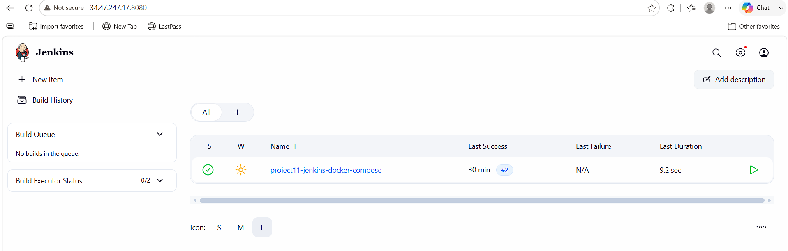
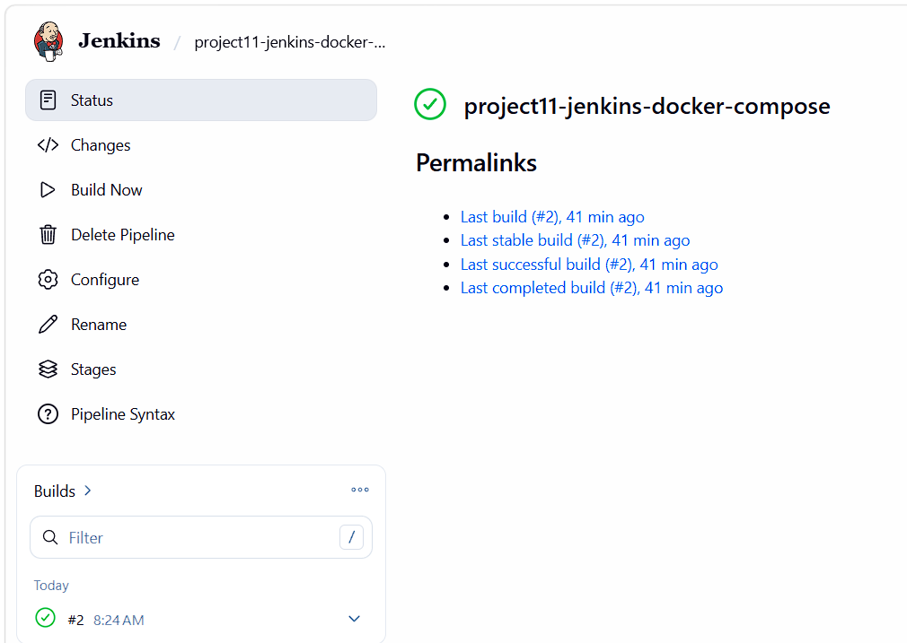
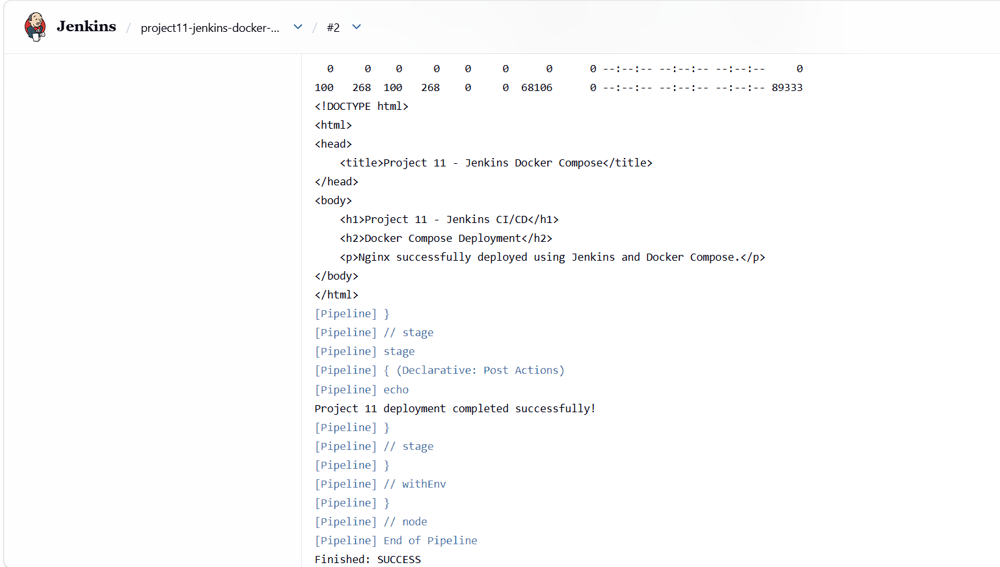
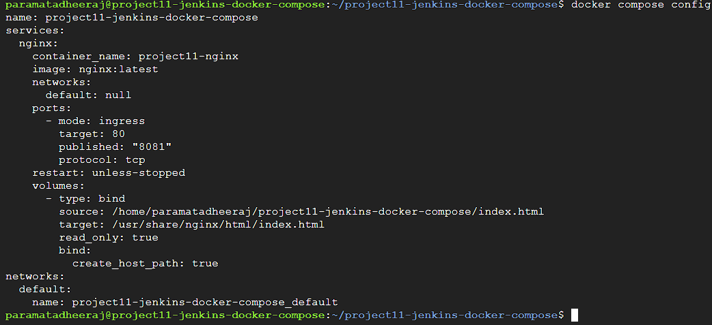
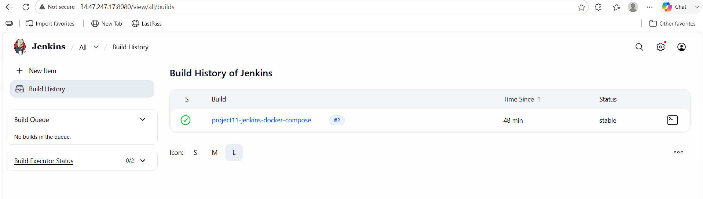
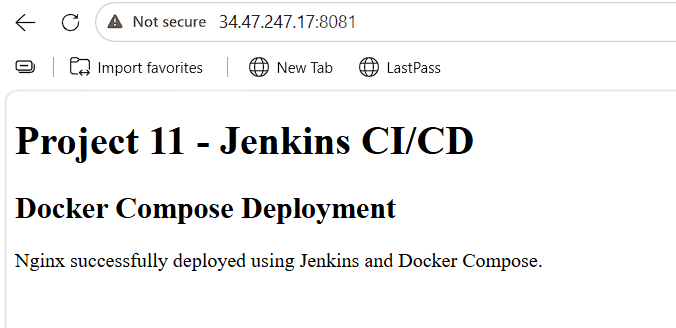

# 🚀 Project 11 – Jenkins CI/CD with Docker Compose

## 📌 Project Overview

This project demonstrates a complete CI/CD pipeline using:

**GitHub → Jenkins → Docker → Docker Compose → Nginx**

The project automates the deployment of a simple Nginx web application on an Ubuntu cloud VM.

Jenkins retrieves the source code from GitHub, validates the Docker Compose configuration, deploys the Nginx container, and automatically verifies that the application is running successfully.

During the project, a real-world Docker networking issue was encountered where port `8080` was already being used by Jenkins. The issue was identified and resolved by changing the Nginx host port from `8080` to `8081`.

---

## 🏗️ Project Architecture

```text
                         Developer
                             |
                             | git push
                             v
                    +----------------+
                    |     GitHub     |
                    |   Repository   |
                    +-------+--------+
                            |
                            | Checkout
                            v
                    +----------------+
                    |    Jenkins     |
                    |     CI/CD      |
                    +-------+--------+
                            |
                            | Pipeline
                            v
                +-------------------------+
                |   Validate Docker       |
                |       Compose           |
                +-----------+-------------+
                            |
                            v
                +-------------------------+
                |    Docker Compose       |
                |      Deployment         |
                +-----------+-------------+
                            |
                            v
                +-------------------------+
                |    Nginx Container      |
                |    project11-nginx      |
                +-----------+-------------+
                            |
                            | Port 8081
                            v
                    +----------------+
                    |  Web Browser   |
                    | Nginx Website  |
                    +----------------+
```

---

# 🔄 CI/CD Workflow

The complete CI/CD workflow is:

```text
GitHub
   ↓
Jenkins
   ↓
Checkout Source Code
   ↓
Validate Docker Compose
   ↓
docker compose down
   ↓
docker compose up -d
   ↓
Check Container Status
   ↓
Test Application using curl
   ↓
Deployment Successful
```

---

# 🛠️ Technologies Used

| Technology | Purpose |
|---|---|
| Git | Version Control |
| GitHub | Source Code Repository |
| Jenkins | CI/CD Automation |
| Docker | Containerization |
| Docker Compose | Container Deployment |
| Nginx | Web Server |
| Ubuntu 24.04 | Operating System |
| HTML | Web Application |
| Google Cloud VM | Cloud Infrastructure |

---

# ☁️ Environment Details

| Component | Configuration |
|---|---|
| Operating System | Ubuntu 24.04 |
| Git | 2.43.0 |
| Docker | 29.1.3 |
| Docker Compose | 2.40.3 |
| Jenkins | Jenkins CI/CD Server |
| Nginx | nginx:latest |
| Jenkins Port | 8080 |
| Nginx Port | 8081 |

---

# 📁 Project Structure

```text
project11-jenkins-docker-compose/
│
├── Jenkinsfile
├── docker-compose.yml
├── index.html
├── README.md
│
└── screenshots/
    ├── jenkins-dashboard.png
    ├── jenkins-job.png
    ├── jenkins-pipeline.png
    ├── docker-compose.png
    ├── jenkins-success.png
    └── nginx-webpage.png
```

---

# 🖥️ Step 1 – Create the Project Directory

The project directory was created on the Ubuntu cloud VM.

```bash
mkdir project11-jenkins-docker-compose
```

Move into the project directory:

```bash
cd project11-jenkins-docker-compose
```

Check the current directory:

```bash
pwd
```

List the files:

```bash
ls
```

---

# 🔍 Step 2 – Check the Environment

The operating system was verified using:

```bash
lsb_release -a
```

Git was checked using:

```bash
git --version
```

Docker was checked using:

```bash
docker --version
```

Docker Compose was checked using:

```bash
docker compose version
```

Installed versions:

```text
Git version 2.43.0
Docker version 29.1.3
Docker Compose version 2.40.3
```

---

# 🐳 Step 3 – Install and Start Docker

Docker was enabled and started using:

```bash
sudo systemctl enable --now docker
```

Check Docker service status:

```bash
sudo systemctl status docker
```

Verify Docker:

```bash
docker --version
```

Verify Docker Compose:

```bash
docker compose version
```

---

# ⚙️ Step 4 – Configure Jenkins for Docker

Jenkins needs permission to communicate with the Docker daemon.

The Jenkins user was added to the Docker group:

```bash
sudo usermod -aG docker jenkins
```

Jenkins was restarted:

```bash
sudo systemctl restart jenkins
```

Jenkins status was checked:

```bash
sudo systemctl status jenkins --no-pager
```

The Jenkins service was successfully running:

```text
Active: active (running)
```

---

# 🔐 Step 5 – Verify Docker Access from Jenkins

Docker access for the Jenkins user was checked using:

```bash
sudo -u jenkins docker --version
```

Docker Compose access was checked using:

```bash
sudo -u jenkins docker compose version
```

Running Docker containers were checked using:

```bash
sudo -u jenkins docker ps
```

These commands confirmed that Jenkins could communicate with Docker.

---

# 🌐 Step 6 – Create the HTML Application

The application is a simple HTML web page served through Nginx.

The file created was:

```text
index.html
```

Contents:

```html
<!DOCTYPE html>
<html>
<head>
    <title>Project 11 - Jenkins Docker Compose</title>
</head>
<body>
    <h1>Project 11 - Jenkins CI/CD</h1>
    <h2>Docker Compose Deployment</h2>
    <p>Nginx successfully deployed using Jenkins and Docker Compose.</p>
</body>
</html>
```

The HTML page is mounted into the Nginx container using Docker Compose.

---

# 🐳 Step 7 – Create Docker Compose Configuration

The Docker Compose configuration is stored in:

```text
docker-compose.yml
```

The configuration used in the final project is:

```yaml
services:
  nginx:
    image: nginx:latest
    container_name: project11-nginx

    ports:
      - "8081:80"

    volumes:
      - ./index.html:/usr/share/nginx/html/index.html:ro

    restart: unless-stopped
```

---

# 📖 Docker Compose Configuration Explanation

## Nginx Image

```yaml
image: nginx:latest
```

The official Nginx Docker image is used.

---

## Container Name

```yaml
container_name: project11-nginx
```

The Nginx container is named:

```text
project11-nginx
```

---

## Port Mapping

```yaml
ports:
  - "8081:80"
```

This maps:

```text
Host Port 8081
      |
      v
Container Port 80
```

Nginx listens on port `80` inside the container.

The host exposes Nginx through port `8081`.

---

## Volume

```yaml
volumes:
  - ./index.html:/usr/share/nginx/html/index.html:ro
```

The local `index.html` file is mounted into the Nginx web directory.

The `ro` option means the file is mounted as read-only.

---

## Restart Policy

```yaml
restart: unless-stopped
```

Docker automatically restarts the container unless it has been manually stopped.

---

# 🧩 Step 8 – Create the Jenkins Pipeline

The Jenkins pipeline is defined in:

```text
Jenkinsfile
```

The Jenkinsfile used for the project is:

```groovy
pipeline {

    agent any

    stages {

        stage('Checkout') {
            steps {
                checkout scm
            }
        }

        stage('Validate Docker Compose') {
            steps {
                sh 'docker compose config'
            }
        }

        stage('Deploy with Docker Compose') {
            steps {
                sh 'docker compose down'
                sh 'docker compose up -d'
            }
        }

        stage('Verify Deployment') {
            steps {
                sh 'docker compose ps'
                sh 'curl -f http://localhost:8081'
            }
        }
    }

    post {

        success {
            echo 'Project 11 deployment completed successfully!'
        }

        failure {
            echo 'Project 11 deployment failed.'
        }
    }
}
```

---

# 🔍 Jenkins Pipeline Stages

## Stage 1 – Checkout

Jenkins retrieves the source code from GitHub.

```groovy
stage('Checkout') {
    steps {
        checkout scm
    }
}
```

The repository contains:

```text
Jenkinsfile
docker-compose.yml
index.html
README.md
```

---

## Stage 2 – Validate Docker Compose

Jenkins executes:

```bash
docker compose config
```

This verifies that the Docker Compose configuration is valid before deployment.

The final configuration used:

```text
Host Port: 8081
Container Port: 80
```

---

## Stage 3 – Deploy with Docker Compose

Jenkins first removes any existing deployment:

```bash
docker compose down
```

Then it starts the new deployment:

```bash
docker compose up -d
```

Docker Compose creates the required network and Nginx container.

The container created is:

```text
project11-nginx
```

---

## Stage 4 – Verify Deployment

Jenkins checks the running container:

```bash
docker compose ps
```

The final deployment showed:

```text
NAME              IMAGE          SERVICE   STATUS
project11-nginx   nginx:latest   nginx     Up
```

The port mapping was:

```text
0.0.0.0:8081 -> 80/tcp
```

Jenkins then tests the application:

```bash
curl -f http://localhost:8081
```

The HTML page is returned successfully.

---

# 🔗 Step 9 – Configure Git

Git was initialized inside the project directory:

```bash
git init
```

The main branch was configured:

```bash
git branch -M main
```

The GitHub repository was added as the remote:

```bash
git remote add origin git@github.com:Dheerajparamata/project11-jenkins-docker-compose.git
```

The remote repository was verified:

```bash
git remote -v
```

---

# 🔐 GitHub Authentication

A GitHub Personal Access Token was configured for Git authentication.

The token used was a **GitHub Classic Personal Access Token**.

The token was named:

```text
My-DevOps-Token
```

The token was used for authentication only and was **not stored inside the project source code**.

Sensitive tokens should never be committed to GitHub.

---

# 📤 Step 10 – Push Project to GitHub

Project files were added:

```bash
git add .
```

The project was committed:

```bash
git commit -m "Complete Project 11 Jenkins Docker Compose CI/CD"
```

The project was pushed to GitHub:

```bash
git push -u origin main
```

GitHub repository:

```text
Dheerajparamata/project11-jenkins-docker-compose
```

---

# 🔗 Jenkins and GitHub Integration

Jenkins was configured to use the GitHub repository as the source control repository.

Jenkins retrieves the project files from GitHub and executes the instructions defined inside the `Jenkinsfile`.

The CI/CD flow is:

```text
GitHub
   ↓
Jenkins
   ↓
Jenkinsfile
   ↓
Docker Compose
   ↓
Nginx
```

---

# ⚠️ Problem Encountered – Port 8080 Conflict

During the first deployment, the Jenkins pipeline failed.

The error was:

```text
failed to bind host port 0.0.0.0:8080/tcp:
address already in use
```

The reason was that Jenkins itself was already using port:

```text
8080
```

The Nginx Docker container was also configured to use:

```text
8080:80
```

Therefore, Docker could not bind Nginx to host port `8080`.

---

# 🔧 Troubleshooting the Port Conflict

The port being used by Jenkins was checked using:

```bash
sudo ss -ltnp | grep :8080
```

The result showed that Jenkins was listening on port `8080`.

Therefore, two services were attempting to use the same host port:

```text
Jenkins → 8080
Nginx   → 8080
```

This caused the Docker deployment to fail.

---

# ✅ Solution – Change Nginx Port

The Nginx host port was changed from:

```text
8080:80
```

to:

```text
8081:80
```

The Docker Compose configuration was updated to:

```yaml
ports:
  - "8081:80"
```

The Jenkins verification command was also changed to:

```bash
curl -f http://localhost:8081
```

The final configuration became:

```text
Jenkins → Port 8080
Nginx   → Port 8081
```

There was no longer a port conflict.

---

# 🚀 Step 11 – Final Deployment

After fixing the port conflict, the Jenkins pipeline was executed again.

Docker Compose successfully created the network:

```text
project11-jenkins-docker-compose_default
```

The Nginx container was created:

```text
project11-nginx
```

The container started successfully:

```text
Container project11-nginx Started
```

---

# 📊 Container Verification

Jenkins executed:

```bash
docker compose ps
```

The final result showed:

```text
NAME              IMAGE          COMMAND                  SERVICE
project11-nginx   nginx:latest   "/docker-entrypoint..." nginx
```

Status:

```text
Up
```

Port:

```text
0.0.0.0:8081->80/tcp
```

This confirmed that the Nginx container was running successfully.

---

# 🧪 Application Verification

Jenkins automatically executed:

```bash
curl -f http://localhost:8081
```

The request successfully returned the application HTML:

```html
<!DOCTYPE html>
<html>
<head>
    <title>Project 11 - Jenkins Docker Compose</title>
</head>
<body>
    <h1>Project 11 - Jenkins CI/CD</h1>
    <h2>Docker Compose Deployment</h2>
    <p>Nginx successfully deployed using Jenkins and Docker Compose.</p>
</body>
</html>
```

The successful `curl` response confirmed that the Nginx web server was working correctly.

---

# 🎉 Jenkins Final Result

The final Jenkins pipeline completed successfully.

```text
[Pipeline] End of Pipeline
Finished: SUCCESS
```

Jenkins displayed:

```text
Project 11 deployment completed successfully!
```

Final pipeline status:

```text
SUCCESS
```

---

# 🌐 Access the Application

The Nginx application can be accessed from a web browser using:

```text
http://<VM_EXTERNAL_IP>:8081
```

Example:

```text
http://YOUR_VM_EXTERNAL_IP:8081
```

The browser displays:

```text
Project 11 - Jenkins CI/CD

Docker Compose Deployment

Nginx successfully deployed using Jenkins and Docker Compose.
```

---

# 🔥 Firewall Configuration

Because the application is deployed on a cloud VM, TCP port `8081` must be allowed through the VM firewall/security rules.

Required rule:

```text
Protocol : TCP
Port     : 8081
```

After allowing port `8081`, the application can be accessed using:

```text
http://<VM_EXTERNAL_IP>:8081
```

---

# 📸 Screenshots

## Jenkins Dashboard

The Jenkins server was successfully installed and running.



---

## Jenkins Job

The Project 11 Jenkins job was created and configured.



---

## Jenkins Pipeline

The Jenkins pipeline was configured to retrieve the project from GitHub and execute the CI/CD stages.



---

## Docker Compose Configuration

Docker Compose was configured to deploy the Nginx container.



---

## Jenkins Successful Build

After resolving the port conflict, the Jenkins pipeline completed successfully.



---

## Nginx Web Application

The deployed Nginx application was successfully accessed through the browser.



---

# 📋 Pipeline Execution Summary

| Stage | Result | Description |
|---|---|---|
| Checkout | ✅ SUCCESS | Retrieved project from GitHub |
| Validate Docker Compose | ✅ SUCCESS | Validated Compose configuration |
| Deploy with Docker Compose | ✅ SUCCESS | Started Nginx container |
| Verify Deployment | ✅ SUCCESS | Verified container and application |
| Final Pipeline | ✅ SUCCESS | Deployment completed successfully |

---

# 💻 Important Commands

## Linux

```bash
ls
pwd
cd ~/project11-jenkins-docker-compose
```

---

## Git

```bash
git init
git branch -M main
git status
git add .
git commit -m "Complete Project 11 Jenkins Docker Compose CI/CD"
git remote -v
git push -u origin main
```

---

## Docker

```bash
docker --version
docker ps
docker compose version
docker compose config
docker compose down
docker compose up -d
docker compose ps
```

---

## Jenkins

```bash
sudo systemctl enable --now jenkins
sudo systemctl status jenkins --no-pager
sudo systemctl restart jenkins
sudo usermod -aG docker jenkins
```

---

## Docker Permission Testing

```bash
sudo -u jenkins docker --version
sudo -u jenkins docker compose version
sudo -u jenkins docker ps
```

---

## Application Testing

```bash
curl -f http://localhost:8081
```

---

## Port Checking

```bash
sudo ss -ltnp | grep :8080
```

---

# 📚 What I Learned

Through this project, I gained practical hands-on experience with Jenkins, Docker, Docker Compose, Git, GitHub and Nginx.

## Jenkins

- Installing Jenkins
- Starting and managing Jenkins
- Creating Jenkins Pipeline jobs
- Creating and using Jenkinsfiles
- Running shell commands from Jenkins
- Integrating Jenkins with GitHub
- Automating deployment using Jenkins

## Docker

- Installing Docker
- Managing Docker containers
- Checking Docker images
- Giving Jenkins access to Docker
- Running Nginx using Docker
- Managing container ports

## Docker Compose

- Creating a `docker-compose.yml`
- Defining services
- Mapping ports
- Mounting volumes
- Starting and stopping services
- Validating Compose configuration
- Deploying applications using Compose

## Git and GitHub

- Initializing Git repositories
- Creating commits
- Creating GitHub repositories
- Configuring GitHub remotes
- Pushing source code to GitHub
- Using GitHub as the CI/CD source repository
- Authenticating Git operations using a Personal Access Token

## Troubleshooting

I also learned how to identify and resolve a Docker port conflict.

Initial configuration:

```text
Jenkins → 8080
Nginx   → 8080
```

This caused the deployment to fail.

Final configuration:

```text
Jenkins → 8080
Nginx   → 8081
```

The deployment then completed successfully.

---

# 🧠 DevOps Concepts Demonstrated

## Continuous Integration

GitHub stores the application source code and Jenkins retrieves the latest project version.

```text
Developer
    ↓
Git Push
    ↓
GitHub
    ↓
Jenkins
```

---

## Continuous Deployment

Jenkins automatically deploys the application using Docker Compose.

```text
Jenkins
   ↓
docker compose down
   ↓
docker compose up -d
   ↓
Nginx
```

---

## Infrastructure as Code

Docker Compose defines the application environment and deployment configuration in a YAML file.

```text
docker-compose.yml
```

---

## Automation

The Jenkins pipeline automates:

```text
Checkout
   ↓
Validation
   ↓
Deployment
   ↓
Verification
```

---

## Automated Testing

The application is automatically tested using:

```bash
curl -f http://localhost:8081
```

If the request succeeds, the deployment is considered successful.

---

# 🔐 Security Considerations

Sensitive credentials such as GitHub Personal Access Tokens should never be committed to GitHub.

Do not place tokens directly inside:

```text
Jenkinsfile
docker-compose.yml
README.md
```

Jenkins Credentials should be used whenever authentication is required.

The GitHub token used for this project was not stored in the source code.

---

# 📈 Future Improvements

This project can be extended by adding:

- GitHub Webhooks
- Automatic Jenkins builds after GitHub pushes
- Docker image versioning
- Docker Hub integration
- HTTPS using SSL/TLS
- Nginx reverse proxy
- Environment variables
- Jenkins Credentials management
- Automated rollback
- Docker image scanning
- Automated security scanning
- Monitoring using Prometheus and Grafana
- Deployment to Kubernetes
- Blue-Green deployment
- Production-grade CI/CD pipeline

---

# 🏆 Project Outcome

The final CI/CD pipeline successfully automates the deployment of an Nginx web application.

The final architecture is:

```text
                         GitHub
                            |
                            v
                         Jenkins
                            |
                            v
                    Docker Compose
                            |
                            v
                     Nginx Container
                            |
                            v
                       Port 8081
                            |
                            v
                       Web Browser
```

The complete DevOps workflow is:

```text
GitHub
   ↓
Jenkins
   ↓
Docker Compose
   ↓
Nginx
   ↓
Automated Verification
   ↓
Successful Deployment
```

Final Jenkins pipeline result:

```text
SUCCESS
```

The application was successfully deployed and verified.

---

# ✅ Project Checklist

- [x] Ubuntu VM configured
- [x] Git installed
- [x] Docker installed
- [x] Docker Compose installed
- [x] Jenkins installed
- [x] Jenkins service running
- [x] Jenkins added to Docker group
- [x] Docker access verified from Jenkins
- [x] Git repository created
- [x] GitHub repository configured
- [x] `index.html` created
- [x] `docker-compose.yml` created
- [x] `Jenkinsfile` created
- [x] Jenkins Pipeline configured
- [x] Docker Compose validated
- [x] Nginx container deployed
- [x] Port conflict identified
- [x] Port conflict resolved
- [x] Nginx moved to port 8081
- [x] Container verified
- [x] Application verified using curl
- [x] Browser access verified
- [x] Jenkins build completed successfully
- [x] Screenshots added to README

---

# 🎯 Final Result

**Project 11 – Jenkins CI/CD with Docker Compose was successfully completed.**

The project demonstrates a practical DevOps workflow using:

```text
Git
 +
GitHub
 +
Jenkins
 +
Docker
 +
Docker Compose
 +
Nginx
```

The application was automatically deployed and verified through Jenkins.

## 🚀 Final CI/CD Pipeline

```text
GitHub
   ↓
Jenkins
   ↓
Docker Compose
   ↓
Nginx Container
   ↓
Port 8081
   ↓
Web Browser
```

---

# 👨‍💻 Author

## Dheeraj Paramata

GitHub:

**Dheerajparamata**

Repository:

**project11-jenkins-docker-compose**

---

# ⭐ Project Status

| Component | Status |
|---|---|
| Ubuntu VM | ✅ Completed |
| Git | ✅ Completed |
| GitHub | ✅ Completed |
| Jenkins | ✅ Completed |
| Jenkins CI/CD | ✅ Completed |
| Docker | ✅ Completed |
| Docker Compose | ✅ Completed |
| Nginx Deployment | ✅ Completed |
| Automated Verification | ✅ Completed |
| Port Conflict Resolution | ✅ Completed |
| Browser Verification | ✅ Completed |
| Final Jenkins Build | ✅ SUCCESS |

---

# 🎉 Project Completed Successfully

**GitHub → Jenkins → Docker Compose → Nginx → Web Browser**

🚀 **Project 11 completed successfully!**
